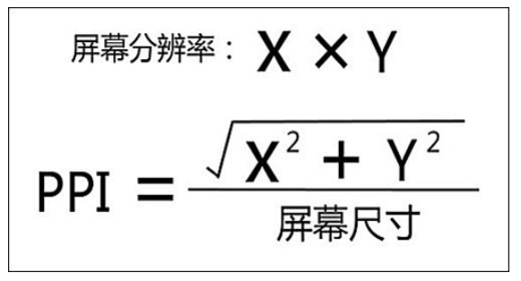

# CSS

标签（空格分隔）： css

---

### 元素居中
1.文本居中: <br> (1) 单行文本居中：```line-height = height```or 盒模型高度；
            (2) 多行文本居中：```padding = (盒模型高度 - 总行高) / 2；```<br> &nbsp;&nbsp;&nbsp;&nbsp;
            note:盒模型高度-总行高=p标签除了文字内容之外的高度空间,因此通过上下分配padding把文字挤压到中间.行高和文字大小的关系，如font-size:12px;&nbsp;line-height:36px;表示行高为字体大小的3倍；
            (3)```vertical-align:middle;``` ：只适用于行内元素、行内块元素、表格里的单元格
2.

### background-image 代替 img
> 当图片为超大宽度的banner图时，图片会溢出页面宽度，导致出现滚动条。而用background-image的好处是，利用**```background-position:center center;```**可以保证banner图始终位于中间，并且图片随着页面宽度缩小而溢出的部分会被忽略不显示而图片的主要内容始终在中间。如下图


### 后代选择器和子代选择器的区别

```
<style type="text/css">
    div p {

    }
    div > p {
    }
</style>
<!--后代选择器可以选择div下所有的p标签,而子代选择器只能选择div下的一层p标签-->
<div>
    <ul>
        <li>
            <p>我是div的重孙子</p>
        </li>
    </ul>
</div>

<div>
    <p>我是div的儿子</p>
</div>
```

### 标准盒模型和IE盒模型的区别
>相同：都包含了margin、padding、border、content；
不同：

1. 在标准盒子模型中，width 和 height 指的是内容区域的宽度和高度。增加内边距、边框和外边距不会影响内容区域的尺寸，但是会增加元素框的总尺寸.
2. IE盒子模型中，width 和 height 指的是内容区域+border+padding的宽度和高度。

### 画个三角形
>假设有一个正方形的容器，高度和宽带为0，而border为100px，此时四个边框将由上下左右四个三角形组成一个正方形，当设置容器宽度和高度时，盒子的content宽高将会扩张，挤压四个三角形向正方形中心的角，导致三角形变成了梯形。

```
<style>
    /* 普通三角形 */
    div {
        width: 0px;
        height: 0px;
        border: 50px solid green;
        border-top-color: red;
        border-bottom: none;
    }
    /* 等边三角形 */
    div {
        width: 0px;
        height: 0px;
        border: 30px solid green;
        border-left: 20px solid transparent;
        /* 通过改变两边的像素点实现 */
        border-right: 20px solid transparent;
    }
</style>
```

### border-radius
><https://www.jianshu.com/p/ca82b9ba9107> 看说明，当border-radius值小于border时，边框内部不会有圆角，当border-radius值大于border时，边框内部又会在四个内角画一个半径值为（border-radius值 - border值）的圆，这就是为什么容器content会被挤压的原因

### 消除浮动带来的影响
> 浮动脱离了标准文档流，**任何脱离了文档流的元素不区分行内块元素，可以直接设置宽高**。标准文档流相当于蓄水池的地砖，而浮动后相当于蓄水池蓄水之后漂浮在水面上，浮动后的元素需要消除浮动带来的影响。蓄水池本身如果不设置高度只有地板，水面上的漂浮物（浮动元素宽高）是无法撑高蓄水池的高度的。

>**消除影响方式1**: 给祖先元素设置高度。即在蓄水池蓄水浮动其它物体之前需要提前把蓄水池建高；

>消除影响方式2: 有就换行。先前讲的给蓄水池建好高度是不理想的，因为有时候根本不知道需要放多少水。一个元素浮动，另一个元素不浮动，给不浮动的元素设置```clear:both```，即不允许该标签左右有浮动元素，因此可以采用这种方法。

>消除影响方式3: 但是设置了```clear:both```的元素是无法设置margin的，为了让两个元素之间能够隔离开来，在两个元素中间设置一个工具人，即这个工具人只设置```clear:both;height:123px;```，而先前设置了clear的元素就不用设置了。相当于在两个元素之间放了个隔板。

>**消除影响方式4**: 但是上述方法只能针对容器内存在不浮动的元素，因此当容器内全部元素浮动，又不想给容器设置固定高度，此时可以在容器内设置一个内容为空的div标签，然后设置样式```clear:both```,这样容器的高度就可以"恢复"了。这样做的目的是让一个容器“恢复”高度。

>**消除影响方式5**:给**浮动元素的父亲**添加```overflow:hidden;``` 或者```display:float-root;``` 或者```clear:both```,被赋予任意一个样式，父亲都会触发BFC，同时父亲能排除外部浮动

### 相对定位和绝对定位
>相对定位：position:relative; 使用这个属性后，元素不脱离文档流。相当于在停车场停车，元素固定占有车位，但是，这个人的车是悬浮车，可以飞得很高。
>绝对定位：position:absolute;
使用这个属性后，元素脱离文档流，一般情况下，规定父亲相对定位，儿子绝对定位，相当于儿子在父亲的停车位上停了一个小玩具车，实际上这个停车位并不是它的。注意：
>
>1. 绝对定位中，top的参考点是**页面**的左上角，而bottom的参考点是**浏览器首屏窗口**的左下角。如果停车场相当于页面，停车位相当于浏览器窗口，那么top就以停车场的左上角为参考点，而bottom以第一次看到的停车位（首屏页面即第一次加载时浏览器窗口）左下角作为参考点，当停车位移动时（浏览器向下滑动）时，设置了bottom的元素始终以第一次没变动的停车位（首屏浏览器窗口）的左下角为参考点。
>2. 绝对定位的元素，父容器设置了相对定位，那么绝对定位的元素将无视父元素的padding,相当于在停车位内，父亲美名其曰为了保障儿子的安全，加上了padding画上了线,试图缩小儿子在停车位的空间，但是儿子无视了这个线

>3.绝对定位元素在容器中居中：left:50%; margin-left:负的绝对定位元素的一般宽度。

>>对于z-index，只有定位了的元素，才能有z-index值。也就是说，不管相对定位、绝对定位、固定定位，都可以使用z-index值。而浮动的元素不能用。

### logo-SEO优化

```
<!--错误写法-->
<div class="logo">
    
</div>
<style>
.header .logo{
        float: left;
        margin-right: 40px;
}
</style>

<!--正确写法-->
<h1 class="logo">
 <a href="#">
  腾讯游戏-中国最大的游戏公司
 </a>
</h1>
<style>
.header .logo{
 float: left;
 padding-left: 12px;
 margin-right: 39px;
 width: 174px;
 height: 58px;
}
.header .logo a{
 display: block;
 width: 174px;
 height: 58px;
 background:url(images/logo.png) no-repeat;
 text-indent: -999em;
}
</style>
```

### justify-content中space-around和sapce-between、space-evenly的区别
>相同：全部子元素按主轴排列方式分配剩余空间
>不同：space-around:两边元素距离边框相同的一定距离，使得各个元素之间的间隔相同
>space-between:两边元素靠着边框，中间子元素分配剩余空间使得使得各个元素之间的间隔相同
>space-evenly:所有元素之间间隔相同，并且两边元素与边框的间隔和元素之间的间隔相同

例子：五个小朋友在一个房间里面，按照一字排队，分别叫甲乙丙丁戊，space-around就是说，甲和戊小朋友靠近墙，但不是贴着，剩余小朋友站中间，甲和戊各自靠近墙的距离是相同的，这个距离刚好能够使得甲乙丙丁五个小盆友之间的间隔相同。
space-between就是说，甲和戊小朋友贴着墙，然后乙丙丁三个小朋友各自间隔站着，使得各个小朋友之间的间隔相同。
space-evenly就是说，所有小朋友的间隔=甲和戊小朋友与墙之间的间隔

### 百度钱包旋转图

```
<!DOCTYPE html>
<html>
<head lang="en">
    <meta charset="UTF-8">
    <title></title>
    <style>
        body {
            background-color: cornflowerblue;
        }

        .box {
            width: 300px;
            height: 300px;
            /*border: 1px solid #000;*/
            margin: 50px auto;
            position: relative;
        }

        .box > div {
            width: 100%;
            height: 100%;
            position: absolute;
            /*border: 1px solid #000;*/
            border-radius: 50%;
            transition: all 2s;
            backface-visibility: hidden; /*容器旋转180度时，背面不显示*/
        }

        .box1 {
            background: url(images/bg.png) left 0 no-repeat; /*默认显示图片的左半边*/
        }

        .box2 {
            background: url(images/bg.png) right 0 no-repeat;
            transform: rotateY(180deg); /*让图片的右半边默认时，容器旋转180度，就可以暂时隐藏起来*/

        }

        .box:hover .box1 {
            transform: rotateY(180deg); /*让图片的左半边转消失*/
        }

        .box:hover .box2 {
            transform: rotateY(0deg); /*让图片的左半边转出现*/
        }
    </style>
</head>
<body>
<div class="box">
    <div class="box1"></div>
    <div class="box2"></div>
</div>
</body>
</html>
```


>这里面最关键的问题是，当背景图片大于容器的宽度时，对background-position：left 和 right理解，left表示背景图片的最左边一定与容器的最左边相接，而right表示背景图片的最右边与容器的最右边相接触；并且rotateY()的相对位置取决容器大小；
>补充：background-position: 20%；x方向上表示（父容器的宽度-图片宽度）*20%，y方向上默认50%即（父容器的宽度-图片宽度）*50%；如何理解50%？答：可以理解为top:50%,translateY(-50%);

### css选择器

1. div>p:nth-child(even):在div中找到所有子代元素，并且找到子代元素中的p元素，这个p元素恰好是第偶数；如div { p(1) p(2) div(3){p p} p(4) div(5){p p} p(6) dic(7) },这个选择器会找到p(1) p(2) div(3) p(4) div(5) p(6) div(7),选出p元素p(1) p(2) p(4) p(6),找到第偶数个：p(2) p(4)

2.div>p:last-child:在div中找到所有子代元素，并且找到子代元素中的p元素，这个p元素恰好是最后一个，如div { p(1) p(2) div(3){p p} p(4) div(5){p p} p(6) dic(7) }，先找到子代p(1) p(2) div(3) p(4) div(5) p(6) div(7)，然后找到p元素p(1) p(2)  p(4)  p(6)，找到p元素并且这个p元素为div子代的最后一个元素，显然p(6)并不是div子代的最后一个元素；

3.only-child : 选择没有任何兄弟元素的元素

4. 选择器分类：（1）传统 CSS2.1 选择器:
a.标签选择器和 id 选择器
b.  class（类）选择器
c.复合选择器
d.伪类
(2)CSS3 新增选择器:
a.元素关系选择器
b.序号选择器
c.属性选择器
d.CSS3 新增伪类
e.伪元素

### css 选择器优先级
> 当同一个dom元素具有不同的选择器样式时，将按照一下规则进行渲染，优先级从高到底：**内联样式>id选择器>类选择器>标签选择器**
当出现多种选择器渲染同一元素的同一个样式属性时，按照选择器数量和种类决定其优先级，规定：A=1000  B=100  C=10  D=1
属于A的选择器：内联样式
属于B的选择器：id选择器
属于C的选择器：类选择器、属性选择器
属于D的选择器：标签选择器
优先级计算方式 = **A+B*（选择器中id的数量）+C*（类选择器和属性选择器及其伪类的数量）+D*（标签选择器及其伪类的数量）**
最终应用其计算结果大的样式,例如

```
 *             {}  /* a=0 b=0 c=0 d=0 -> specificity = 0,0,0,0 */
 li            {}  /* a=0 b=0 c=0 d=1 -> specificity = 0,0,0,1 */
 li:first-line {}  /* a=0 b=0 c=0 d=2 -> specificity = 0,0,0,2 */
 ul li         {}  /* a=0 b=0 c=0 d=2 -> specificity = 0,0,0,2 */
 ul ol+li      {}  /* a=0 b=0 c=0 d=3 -> specificity = 0,0,0,3 */
 h1 + *[rel=up]{}  /* a=0 b=0 c=1 d=1 -> specificity = 0,0,1,1 */
 ul ol li.red  {}  /* a=0 b=0 c=1 d=3 -> specificity = 0,0,1,3 */
 li.red.level  {}  /* a=0 b=0 c=2 d=1 -> specificity = 0,0,2,1 */
 #x34y         {}  /* a=0 b=1 c=0 d=0 -> specificity = 0,1,0,0 */
 style=""          /* a=1 b=0 c=0 d=0 -> specificity = 1,0,0,0 */
```

>即内联样式选择器为RMB1000块，id选择器为100块，类选择器和属性选择器为10块（后面跟上的伪类相当于价值10块的商品），标签选择器为1块（如果后面跟上的伪类相当于价值1块的商品），最后我们会计算每个选择器的总价值，最终dom元素会取走最高价的样式

### 页面布局的几种方式
布局方法：浮动、绝对定位、flex、table、grid
1.左右宽度固定，中间自适应：
    （1）浮动：左右浮动；注：中间的元素放最右边；
    （2）绝对定位：左右left:0,right:0,中间设置margin:0 左右宽度；注：如果中间也设置绝对定位也会导致高度坍塌；
    （3）flex: 父容器设置flex，flex-direction:row,左右设置宽度，中间flex:1；
    （4）table:父容器设置为table且100%,左中右设置为table-cell,左右设置宽度：
    （5）grid: 父容器设置为display:grid；grid-template-row:一行高度；grid-template-columns：左宽度 auto 右宽度；

    对比：浮动需要清除浮动；绝对定位也会导致子元素脱离文档流，实用性较差；flex比较实用；table中的一列高度发生变化时会导致全部列高度同步变化；grid为css3中引入的布局

### CSS盒模型

1. 盒模型内容：margin、border、padding、content;
2. 盒模型类别：标准盒模型、IE盒模型。他们都包括margin、border、padding、content,不同之处在于标准盒模型的width只有content,而IE盒模型的width包括content、padding、border;
3. 如何设置盒模型：box-sizing: content-box;  box-sizing: border-box;
4. 如何获取元素的宽高：
                获取行内样式：element.style.width;
                获取外链/内嵌样式： window.getComputedStyle(element).width
                获取元素的位置（相对视窗）：element.getBoundingClientRect().width;

5. margin:是用来描述兄弟之间的距离，在垂直方向上margin会发生重叠，如果都为正值/负值，取绝对值较大的一方，一正一负则合并后计算。而子元素的margin-top将会传递到父元素,并不会与父元素距离开来。取值方式和上面一样；

6. BFC：块级格式化上下文。本质就是产生一个独立块级容器；
7. BFC原理：（1）BFC内部的子元素，垂直外边距会发生重叠；
            （2）BFC是一个独立区域，外部不会对内部造成影响，反之亦然；(解决父子margin传递)
            （3）BFC区域不会与浮动区域重叠；（清除浮动）
            （4）BFC区域计算高度时会把浮动元素的高度计算；（解决高度坍塌）
8. BFC的触发方式：（1）overflow不为visible；
                    （2）float不为none
                    （3）position不为relative/static;
                    （4）display:inline-block/inline-flex/flex/table-cell/table-caption;

### DOM事件

1. DOM事件级别：
    DOM0:element.onclik ;同样的事件会被替代；
    DOM2: element.addEventListener('click',funciton,false);可以设置多个同样事件；
    DOM3:element.addEventListener('keyup',funciton,false);即鼠标事件和键盘事件
2. DOM事件模型：捕获、冒泡
3. DOM事件流：捕获、目标阶段、冒泡
    （1）捕获：如果父子元素均有相同的触发事件。则事件触发过程为：window->document->html->body->父元素->子元素；
    （2）目标阶段：事件从捕获到达目标元素，这个阶段就是目标阶段
    （3）冒泡流程：与捕获阶段相反；
4. 常见的DOM事件API：
event.prevent()阻止事件默认行为；
event.stopPropogation()阻止冒泡；
event.stopImmediatePropogation()设置事件优先级，通常用在元素同一类事件不同执行行为中；
event.currentTarget;触发事件元素的父元素；
event.target;触发事件的元素本身，通常用在事件委托中

### 容易遗漏的知识点

1. font-size:200%；相对于父元素的font-size而言
2. @font-face:{font-family:;src:url();}; 使用自定义的字体
3. line-height:2; 一般工作中实用数字或者百分比，2表示font-size的两倍大小
4. button标签默认IE盒模型；
5. p 标签里不能放 p 和 div 标签。h1-h6 标签里不能放 p，div 元素；
6. 背景图片位置默认是从 padding 区开始计算，position:20%;表示左偏移值为left = (容器的width+padding)*20% - 图片的width*20%；即先参考容器向右偏移然后再参考图片向左偏移；
7. background-size:百分比是相对于盒子的宽高而言;
8. 浏览器私有前缀：Chrome 浏览器：-webkit-； Firefox 火狐：-moz-；IE、Edge：-ms-；欧朋：-o-；
9. margin负值特性：
margin-left 设置负值，元素自身向左移动，后面的元素也向左移
margin-right 设置负值，自身不受影响，右边元素向左移动
margin-top 设置负值，元素自身向上移动 ，下面的元素也向上移
margin-bottom 设置负值，自身不受影响，下方元素向上移动
总结：左上一起移动，右下则右下兄弟动；
10. 文本溢出变省略号：
单行文本：```white-space:nowrap; text-overflow:ellipsis; overflow:hidden;```
多行文本：```
overflow:hidden;
text-overflow:ellipsis;
display:-webkit-box;
-webkit-line-clamp:需要显示的行数;
-webkit-box-orient:vertical:/*默认显示竖排*/```
11. filter: blur()函数用于将高斯模糊效果应用于元素（图像）,与背景图像结合实现背景模糊
12. 防止拖拽文本域： resize:none;
13. calc() 函数用于动态计算长度值;
14. translate3d(x,y,z);其中x,y,z不能使用百分比，3D中z轴都不能用百分比，被默认无效；
15. Object-fit: cover来等比例裁剪图片尺寸，这样图片就不会被拉伸或压缩;
16. flex:1 = flex: 1 1 0%; flex:auto = 1 1 auto;
17. a标签的color不能被继承，vertical-align和text-decoration不能被继承

### CSS单位
1.px:绝对单位，表示一个像素点，实际大小决定于设备像素比

2.em:相对于当前对象字体大小，如果当前行内字体未设置font-size，则默认1rem = 16px（浏览器默认字体大小）; 通常可以设置body{ font-size:62.5%}，因为62.5%*16px = 10px;

3.rem:相对于:root 即html元素的字体大小绝对；

4.vw、vh:相对于页面视窗大小，把窗口分为100份，100vw即100份视窗宽度。

### 圣杯布局
概念：浮动元素会左右浮动直至遇到边框或者另一个浮动元素。当两个元素的宽度不超过一行的宽度时将会并排呈现，否则另一个浮动元素换行。如果想在不改变两个元素宽度和两个浮动元素宽度超过一行宽度的前提下，实现两个浮动元素并排呈现，可以利用margin-left负值。margin表示当前元素的content和其它元素content之间的距离。而margin-left是指元素的最左边和其它元素最右边盒模型的距离。如果为左边距为负值则content会向左移动。我们先假设center元素为第一个浮动元素，left元素为第二个浮动元素

```
 <style>
    .middle {
        overflow: hidden;
    }
    .center {
        height: 100px;
        width: 100%;
        background-color: green;
        float: left;
    }
    .left {
        height: 200px;
        width: 200px;
        background-color: red;
        float: left;


    }
</style>
<div class="middle">
    <div class="center"></div>
    <div class="left"></div>
</div>
```

（1）当两个浮动元素在两行时，下面的浮动元素margin-left负值没自身宽度大。两个浮动元素仍然会两行呈现。

设置```margin-left: -100px;```

（2）当margin-left负值大于自身浮动元素宽度时，浏览器会认为当前浮动元素已经不在当前行，而是浮动到上一行。
```margin-left: -200px;```


（3）如果margin-left值设置为负百分比，此时是相对于父容器而言，根据这个值算出是否浮动到上一行。如果算出的值是超过自身浮动元素的宽度则拉到上一行。此时需要注意的是，第二行的浮动元素被拉到第一行后margin-left的起始位置是相对于原本第一行浮动元素的最右边。

``` margin-left: -100%;```


完整代码
```
<!DOCTYPE html>
<html>
    <head>
        <meta charset=utf-8>
        <style type="text/css">
            * {
                margin: 0;
                padding: 0;
            }
            .container {
                overflow:hidden;
                padding:0 100px; //假设center的width 100%,padding位置留给left和right
                min-width: 100px; //设置最小宽度
                border: 1px solid black;
            }
            .left {
                float:left;
                width:100px;
                margin-left: -100%;  //拉到上一行并距离center的content左边 0px
                position: relative;
                left:-100px; //向右移动100px到container的padding-left区域
                background-color: greenyellow;
            }
            .center {
                float:left;
                width:100%;
                background-color: darkorange;
            }
            .right {
                background-color: darkgreen;
                float:left;
                width:100px;
                margin-left:-100px;  //拉到上一行，此时距离center的content 的右边0px;
                position:relative; //相对于自身移动
                left:100px; //向右移动100px到container的padding-right区域
            }
        </style>
    </head>
    <body>
     <section class="container">
            <article class="center"><br /><br /><br /></article>
            <article class="left"><br /><br /><br /></article>
            <article class="right"><br /><br /><br /></article>
        </section>
    </body>
</html>
```


### 双飞翼布局
概念：在圣杯布局的基础上，取消container的padding为left和right预留的位置,改为在center外添加一个容器，在center添加margin:0 100px;这样做核心在于使用外边距将内容封锁在两边浮动元素的中间。
```
.container {
    border: 1px solid black;
    overflow:hidden;
}
.left {
    background-color: greenyellow;
    float:left;
    width:100px;
    margin-left:-100%;
}
.center {
    background-color: darkorange;
    width:100%;
    margin:0 100px;
}
.right {
    background-color: darkgreen;
    float:left;
    width:100px;
    margin-left:-100px;
}
.centerOuter {
    float:left;
    width:100%;

}

<section class="container">
    <article class="centerOuter"><main class="center"><br /><br /><br /></main></article>
    <article class="left"><br /><br /><br /></article>
    <article class="right"><br /><br /><br /></article>
</section>
```


### 设备像素、css像素、设备独立像素、dpr、ppi是什么
设备像素：即物理像素，设备一经出厂就无法改变，代表设备能够控制的最小物理单位

css像素：像px这样，在不缩放的情况下1px就代表1个设备独立像素

设备独立像素：一个虚拟的像素单位，在PC端不缩放的情况下1个设备独立像素就代表1设备像素

dpr:设备像素比 = 设备像素/设备独立像素

ppi:每英寸像素，值越大，代表每英寸屏幕能容纳的像素越多  

### 1px问题

概念：pc 的浏览器上设置的 1px 的边框，在移动端的浏览器上看上去会“更粗” 一些。这一切跟DPR有关，不同设备的dpr不同，导致1个css像素对应不同的设备像素。

注释：为了解决缩放问题，固定屏幕宽度，通常会设置如下代码。
```
<meta name="viewport" content="width=device-width,initial-scale=1.0,maximum-scale=1.0,minimum=1.0,user-scalable=no">

```
user-scalable=no表示禁止用户缩放
width=device-width代码表示页面宽度设置实际设备宽度，这样1px=1设备像素，initial-scale=1.0,maximum-scale=1.0,minimum=1.0表示css像素缩放的倍数，1.0表示1个css像素 = 1个设备物理像素。0.5表示此时0.5个css像素才等于1个物理设备像素。scale的优先级高于width=device-width

Ratio屏幕的出现使得屏幕最小长度单位不是设备像素，而是{{ devicePixelRatio }}个，当dpr=2时，表示1个css像素=2个设备像素，为了达到1个css像素=1个设备像素，initial-scale=0.5表示将css像素缩小一半，就可以达到这个目的了。因此需要缩放css像素，如何缩放？引入下面的代码

解决方案：  动态修改scale
```
var dpr = window.devicePixelRatio || 1
var scale = 1 / dpr //缩小的倍数
var content = 'width=device-width, initial-scale=' + scale + ', minimum-scale=' + scale + ', maximum-scale=' + scale + ', user-scalable=no'
var viewportEl = document.querySelector(flexible)

if (viewportEl) {
  viewportEl.setAttribute('content', content)
} else {
  viewportEl = document.createElement(flexible)
  viewportEl.setAttribute('name', 'viewport')
  viewportEl.setAttribute('content', content)
  document.head.appendChild(viewportEl)
}
```

我们想设置小屏幕的100px和大屏幕的100px占比是不同的，因此配合使用rem布局。


### 隐藏元素的方式
display:none、visibility:hidden、opacity: 0

其它：height,width=0 或者position:absolute

区别：display会不存在页面中，会触发重排，重绘，而opacity和visibility不会触发重排，opacity还能触发自身绑定事件

### 元素垂直居中的方式

内联元素垂直居中：```line-height = height; text-align = center```

多行文本垂直居中：参照table垂直居中

块级元素垂直居中：

1.利用position：

（1）未知宽高的情况下：```position:absolute; top:0; left:0; right:0; bottom:0; margin:auto;```

（2）已知宽高的情况下：```position:absolute; top:50%;left:50%;margin-left:-自身一半;margin-top:-自身一半;```

（3）未知宽高的情况下：```position:absolute; top:50%;left:50%;transform:translate(-50%,-50%);```

2.利用table:

    ```
    .father {
        display: table-cell;
        vertical-align: middle;
        text-align: center;
    }
    .son {
        display: inline-block;
    }
    ```
3.利用flex布局：
```
 .father {
    display: flex;
    align-items: center;
    justify-content: center;
 }
```
4.利用grid布局：
```
.father {
    display: grid;
    align-items: center;
    justify-content: center;
}
```

### 两栏布局、三栏布局

1.两栏布局：

（1）左浮动、右margin-left

（2）flex:左宽度，右flex:1，父align-items:flex-start(高度自适应)

2.三栏布局：

（1）左右浮动、中间margin:缺点在于主体内容最后加载

（2）左右绝对定位，中间margin

（3）table:父display:table,子display:table-cell,左右设置宽度，中间宽度auto

（4）flex布局

（5）grid布局

### grid布局

概念：即网格布局，属于二维布局，用纵横交互的两组网格线将容器划分为行和列。

```
.container {
    display: grid; //inline-grid为对外行内元素，对内为网格布局

    grid-template-columns: 200px 200px 200px;//设置列数，如果重复用函数repeat(个数，大小)；fr表示将剩余空间划分几等份；auto-fill尽可能的填充；auto浏览器决定
    grid-template-rows: 200px 200px 200px;//同上

    grid-gap:;//每个单元格之间的间隔，grid-columns-gap和grid-rows-gap的简写
    grid-template-areas: 'A A A'
                         'B B B'
                         'C C C'; //将容器分为ABC三个区域

    grid-auto-flow: column/row ; //决定元素排列方式是先行后列还是先列后行
    justify-items: start/end/center/stretch; //决定所有单元格的内容在单元格中的水平排列方式
    align-items: start/end/center/stretch; //决定所有单元格的内容在单元格中的垂直排列方式

    justify-content: start/end/center/space-around/space-evenly/space-between; //决定grid容器在父容器中的水平位置
    align-content: start/end/center/space-around/space-evenly/space-between; //决定grid容器在父容器中的垂直位置

}

.item {
    grid-area: 'A'; //指定该单元格属于自定义的A区域
    justify-self: start/end/center/stretch; //单独决定该元素在单元格中的水平位置
    align-self:; start/end/center/stretch; //单独决定该元素在单元格中的垂直位置
}
```